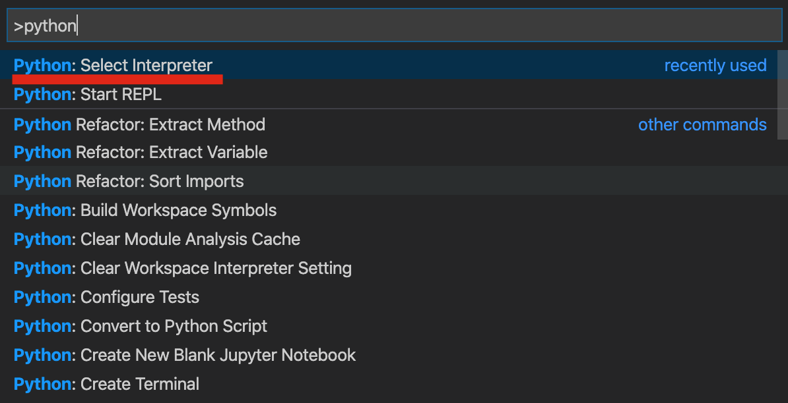
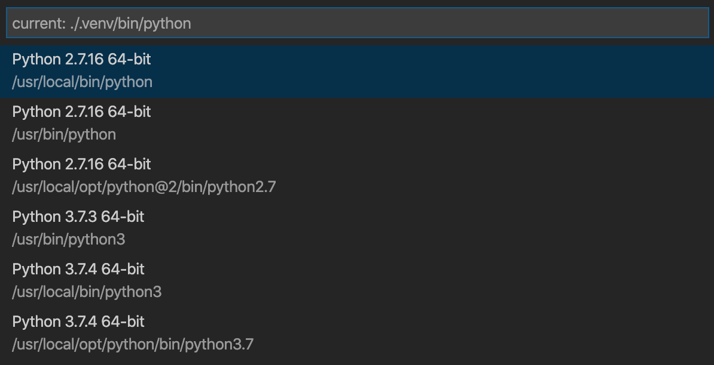
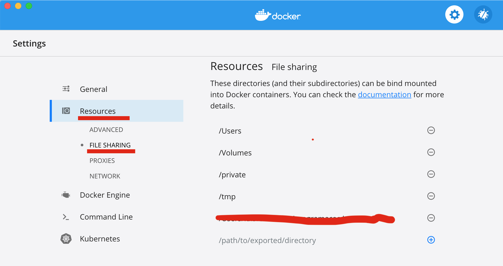

# Preparar o ambiente de trabalho
- É necessário um computador com o sistema operativo *windows*, *macos* ou *linux*.
- É necessário instalar o *visual studio code* [aqui](https://code.visualstudio.com).
- É necessário instalar, se já não estiver instalado, o *python* [aqui](https://www.python.org/downloads/).

# Preparar o visual studio code
- É necessário instalar a extensão do *python* para o *visual studio code* [aqui](https://marketplace.visualstudio.com/items?itemName=ms-python.python).
- criar uma pasta no disco com o nome ***programação*** e dentro dessa pasta outra pasta com o nome de ***curso_python***, é aqui onde vamos trabalhar com *visual studio code*. **Nota:** podem ser outros nomes para as pastas.
- No *visual studio code* é necessário selecionar qual o interpretador de *python* a usar. Para isso vamos ao menu *View* e selecionamos o submenu *Command Palette*, vai aparecer um caixa com o símbolo > e o cursor a piscar. Escrevemos nessa caixa ***Python: Select Interpreter*** de seguida escolhemos a versão do python que queremos, no nosso caso pode ser a versão 3.8, mas outra versão acima de 3.0 pode ser.

  
    <b>Python: Select Interpreter</b>

  

  
    <b>Versão do Python</b>

  

# Contentores
###### Alternativa para quem não consegue instalar o python ou não sabe trabalhar com o python na linha de comandos do windows. **Nota:** também pode ser instalado por quem consegui concluir o processo anterior.

## Docker

- É necessário instalar a aplicação ***docker*** [aqui](https://www.docker.com/products/docker-desktop). Pode ser necessário fazer um registo, mas é grátis [aqui](https://docker.events.cube365.net/docker/dockercon/).
- Depois do ***docker*** instalado vamos testá-lo. Na linha de comandos (terminal ou cmd) escrever o seguinte comando: ***docker --version***. Se correr tudo bem aparecerá algo do tipo: ***Docker version 19.03.5, build 633a0ea***.
- Agora vamos fazer mais um teste. Na linha de comandos escrever: ***docker run hello-world***. Se correr tudo bem, entre outras coisas, aparecerá no terminal: ***Hello from Docker!***.
- Vamos agora instalar o python na aplicação docker para podermos trabalhar. Para tal escrever o seguinte na linha de comandos: ***docker pull python***.
- Agora antes de podermos usar o ***docker*** e o ***python*** vamos configurar a pasta onde vamos trabalhar nas preferencias do docker. O docker quando foi instalado adicionou um icon à barra de menus. Clicamos nesse icon e aparece um menu onde vamos escolher preferencias. Aparecerá um janela como a imagem abaixo. Seguindo o esquema da janela da imagem carregamos no sinal **(+)** e vamos até à pasta que escolhemos para trabalhar (que de acordo com o que aqui foi dito é: ***progamação/curso_python***; se for no windows será do tipo: ***c:\programação\curso_python***; Se for linux será do tipo: ***/home/programação/curso_python*** e se for no mac será do tipo: ***/Users/rubenfernandes/programação/curso_python***).

  
    <b>Docker: preferênciasr</b>

  

- Agora já podemos começar a usar o docker. Para podermos correr os programas que fazemos temos de entrar no contentor e escrever o comando para correr o nosso programa.
    - Para entrar no contertor e interagir com ele escrevemos na linha de comandos o seguinte: 
    
    """docker run -w /curso_python/hello --rm -it -v /Users/rubenfernandes/programacao/curso_python:/curso_python python /bin/bash 
    """  
    
